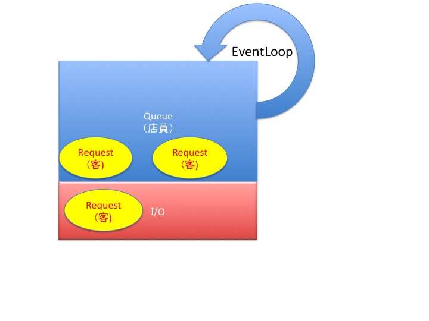

# node.js

## サーバの仕組み
**スレッドモデルとイベントループ**    
* 大量のリクエストをさばくための処理形式
### スレッドモデル
Requestに対し、Thereadを立ち上げて対応  
大量にくると、Request処理待ちが発生する
- Apache等で使われている
    - 世界中で使用されているWebサーバーソフトウェア(HTTPサーバー)
- 基本的に1リクエストに対して、1スレッドで処理を対応する

- スレッドはメモリを消費するため、瞬時的に大量のリクエストがくると多くのスレッドが立ち上がる
- スレッドが多く立ち上げるとメモリが足りなくなるので待ちリクエストが発生
### イベントループモデル
- QueueでEventLoopでまわす（メインスレッド）  
    - Requestを貯めることができる
- I/O(バックグラウンドスレッド)
    - バックグラウンドでリクエストを処理

    **メリット**  
    - 前の処理を終わるまで待つ必要がない    

    **デメリット**  
    - 処理の終了順番がわからない  　  　
    - ループをブロックしないプログラミングが必要　　
        - イベントをブロックしてしまうと、実際待ちが発生



## 記述方法
1. ブロッキング
    ```
    //ブロッキングな書き方
    var start = new Date().getTime();

    while(new Date().getTime() < start + 1000){
                //1秒待つ
    }

    console.log('world');
    ```
    whileの処理（1秒間）の後に`world`を表示する
2. ノンブロッキング
    ```
    //ノンブロッキングな書き方
    //callback関数
    setTimeout(function(){
        console.log('hello');
    },1000);

    console.log('world');
    ```
    **実行結果**
    ```
    $ node hello.js
    world
    hello
    ```
    **処理がかかりそうな処理はcallback関数を使用して処理する**

## Webサーバーの作成
### プロセス終了方法
1. ctrl + c

2.  

- ps aux | grep node
- kill -9 <PROCESS_ID>

3. killall node