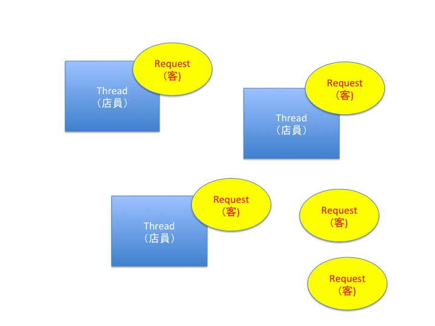

# node.js

## サーバの仕組み
**スレッドモデルとイベントループ**    
* 大量のリクエストをさばくための処理形式
### スレッドモデル
Requestに対し、Thereadを立ち上げて対応  
大量にくると、Request処理待ちが発生する
- Apache等で使われている
    - 世界中で使用されているWebサーバーソフトウェア(HTTPサーバー)
- 基本的に1リクエストに対して、1スレッドで処理を対応する

- スレッドはメモリを消費するため、瞬時的に大量のリクエストがくると多くのスレッドが立ち上がる
- スレッドが多く立ち上げるとメモリが足りなくなるので待ちリクエストが発生
### イベントループモデル
- QueueでEventLoopでまわす（メインスレッド）  
    - Requestを貯めることができる
- I/O(バックグラウンドスレッド)
    - バックグラウンドでリクエストを処理

    **メリット**  
    - 前の処理を終わるまで待つ必要がない    

    **デメリット**  
    - 処理の終了順番がわからない  　  　
    - ループをブロックしないプログラミングが必要　　
        - イベントをブロックしてしまうと、実際待ちが発生


## 記述方法
1. ブロッキング
    ```javascript
    //ブロッキングな書き方
    var start = new Date().getTime();

    while(new Date().getTime() < start + 1000){
                //1秒待つ
    }

    console.log('world');
    ```
    whileの処理（1秒間）の後に`world`を表示する
2. ノンブロッキング
    ```javascript
    //ノンブロッキングな書き方
    //callback関数
    setTimeout(function(){
        console.log('hello');
    },1000);

    console.log('world');
    ```
    **実行結果**
    ```
    $ node hello.js
    world
    hello
    ```
    **処理がかかりそうな処理はcallback関数を使用して処理する**

## Webサーバーの作成
### ファイル分割（exports）
node.jsではデフォルトで`exports`という機能がある   

**使い方**    
    1.よく使う(外部ファイル)変数を`exports.{変数名} = xxx`と定義  
    2.呼び出す元で、`var hoge = require('./xxxx')`  
    3.`hoge.{変数名}`で外部ファイルの値を使う

```javascript
exports.port = 3000;

```
sever.js(呼び出し元)から使用
```javascript
var http = require('http');
var config = require('./config');
var server = http.createServer();

server.on('request',function(req,res) {
    res.writeHead(200, {'Content-Type' : 'text/plain'});
    res.write('hello world');
    res.end();
});

// サーバを待ち受け状態にする
// 第1引数: ポート番号
// 第2引数: IPアドレス
server.listen(config.port);
console.log(config.port);
```

### プロセス終了方法
1. ctrl + c

2.  

- ps aux | grep node
- kill -9 <PROCESS_ID>

3. killall node

## リクエストのURL毎に処理を分割
```javascript:server.js
(省略)
//変更点のみ記述
res.write('request from: ' + req.url);
(省略)
```
**実行結果**


  
上記のようにリクエストURLが取れている

## リクエスト毎の処理の分割
```javascript
(省略)
server.on('request',function(req,res) {
    res.writeHead(200, {'Content-Type' : 'text/plain'});
    //リクエストされた処理に応じて表示内容を変更
    switch (req.url) {
        case '/about':
            msg = 'welcome about page';
            break;
        case '/company':
            msg = 'welcome my company page';
            break;
        default:
            msg = 'page not found';
            break;
    }
    res.write(msg);
    res.end();
});
(省略)
```
**実行結果**  
- /aboutにアクセス  

- /companyにアクセス  

- /それ以外   
  

実行結果から,リクエスト毎に表示させるメッセージが変更されている

## HTMLの表示  
HTMLを読み込むために、**filesystem**を使う！   
filesystemの使い方は右を参照 →
[node.jsの文法](./node.js-file-operation.md "Qiita")


server.js
```javascript
(省略)
//fsモジュールを利用できる状態にする
var fs = require('fs');
(省略)
server.on('request',function(req,res) {
    //ファイルを読み込む処理は時間がかかるため.callback関数を用いてノンブロッキング処理
    fs.readFile(__dirname + '/hello.html','utf-8',function(err,data){
        //エラー発生時
        if (err) {
            res.writeHead(404,{'Content-Type' : 'text/plain'});
            res.write('page not found');
            return res.end();
        }
        res.writeHead(200, {'Content-Type' : 'text/html'});
        //リクエストされた処理に応じて表示内容を変更
        res.write(data);
        res.end();
    });
});

(省略)

```

hello.html  
```html
<body>
    <h1>Hello world</h1>
    <p>this page is written by node.js</p>
</body>
</html>
```

